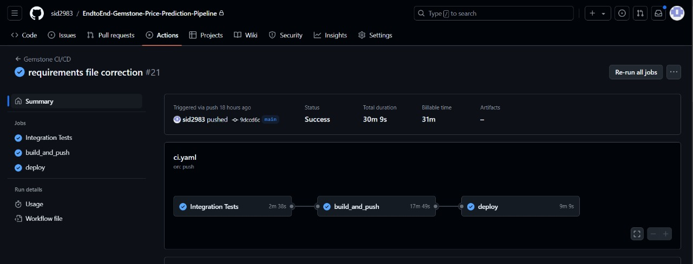

# 🏆 Diamond Price Prediction MLOPS Project

Welcome to the **Diamond Price Prediction MLOps Project**! This project demonstrates the end-to-end automation and deployment of a machine learning pipeline using modern tools like Airflow, MLflow, Docker, DVC, and AWS EC2. It focuses on predicting diamond prices based on key features like carat, clarity, and cut.

  
  
  

---

## 🚀 Project Summary

This project involves building a machine learning model for predicting diamond prices and deploying it in a fully automated MLOps pipeline. The project is hosted on **AWS EC2** and leverages **Docker** to containerize multiple services such as:

- **Airflow**: To orchestrate and manage the entire machine learning workflow.
- **MLflow**: For experiment tracking and model versioning.
- **Flask**: For serving the machine learning model via a REST API.
- **DVC**: For data version control and reproducibility.

The components are designed to run seamlessly within Docker containers, making the pipeline portable and scalable.

---

## 📚 Features

### 🔄 End-to-End Pipeline Automation
- Automated data ingestion, transformation, model training, and model serving.
- Airflow DAGs handle the complete workflow for orchestrating tasks such as **data ingestion, transformation, model training, and deployment**.

### 🧬 Model Versioning with MLflow
- MLflow tracks the performance metrics, hyperparameters, and artifacts of each experiment.
- Easily switch between models and compare different runs to find the best-performing version.

### 📦 Containerized Deployment with Docker
- Entire system packaged into **Docker containers**, ensuring consistency across environments.
- Separate Docker containers for **Airflow, MLflow**, and **Flask** services.

### ☁️ AWS EC2 Hosting and ECR Container Registry
- Deployed the entire pipeline on **AWS EC2** for cloud scalability.
- Data is stored and versioned in **AWS S3** using DVC, ensuring efficient data management.
- Container Images are stored in **AWS ECR** Public and Dockerhub : sid2983/airflow:latest and sid2983/flask:latest

### 📡 REST API for Predictions
- A **Flask** app serves the model and exposes a REST API to make predictions.
- Use `POST` requests with JSON payloads to get diamond price predictions.

### CI-CD Pipeline using Github Actions 
- Job for Continuous Integration after testing
- Job for Building and Pushing Images to Docker Registeries (ECR and Dockerhub)
- Job for Continuous Deployment on AWS EC2 instance.
---

## 🧰 Tech Stack

  
  
  
  
  
  
  
  
  
  
  
  
  
  

- **Languages & Frameworks**: Python, Flask, Tensorflow
- **Containerization**: Docker
- **Container Registry**: Dockerhub, AWS ECR
- **Pipeline Orchestration**: Apache Airflow
- **Experiment Tracking**: MLflow
- **Data Version Control**: DVC
- **Cloud Infrastructure and Deployment**: AWS EC2, S3
- **CI/CD**: GitHub Actions

---

